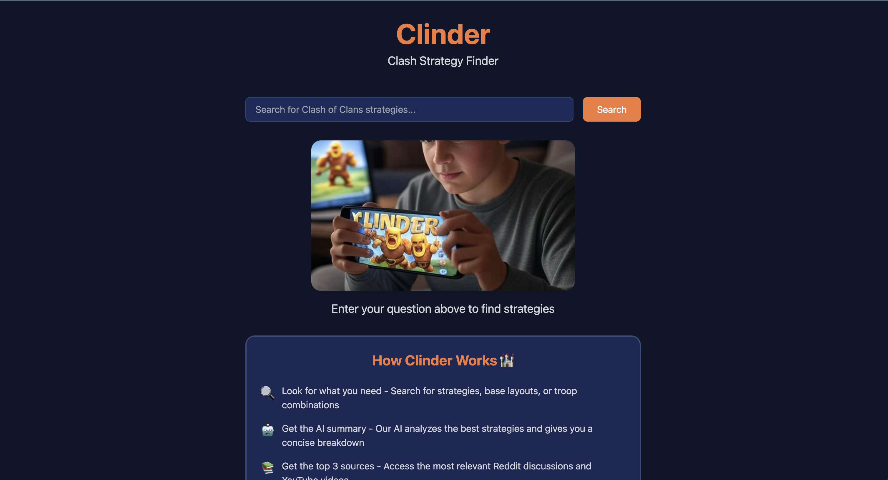

# Clinder - Clash Strategy Finder 🏰

<div align="center">
  
</div>

## About

Clinder is an AI-powered strategy finder for Clash of Clans that helps players discover and implement the best strategies for their gameplay. By combining AI analysis with curated content from Reddit and YouTube, Clinder provides comprehensive strategy insights in a user-friendly format.

## Features

- 🔍 **Smart Search**: Find strategies, base layouts, and troop combinations
- 🤖 **AI Analysis**: Get concise breakdowns of the best strategies
- 📚 **Top Sources**: Access the most relevant Reddit discussions and YouTube videos
- ⚔️ **Copy/Paste**: Easily copy army compositions and base layouts (Coming soon with Supercell integration 🤞🏻)
- ⭐ **Rating System**: Help improve strategies by rating and providing feedback (Coming soon with Supercell integration 🤞🏻)

## Tech Stack

- Frontend: React, TypeScript, TailwindCSS
- Backend: Node.js, Express
- AI: X.AI API (Grok)
- APIs: Reddit API, YouTube Data API

## Getting Started

### Prerequisites

- Node.js (v14 or higher)
- npm or yarn
- API keys for:
  - X.AI
  - Reddit
  - YouTube

### Installation

1. Clone the repository:
```bash
git clone https://github.com/Juls95/ai_supercell_data
cd clinder
```

2. Install dependencies:
```bash
npm install
```

3. Create a `.env` file in the root directory with your API keys:
```env
# Reddit API Credentials
REDDIT_CLIENT_ID=your_reddit_client_id
REDDIT_CLIENT_SECRET=your_reddit_client_secret

# YouTube API Credentials
YOUTUBE_API_KEY=your_youtube_api_key

# X.AI API Credentials
XAI_API_KEY=your_xai_api_key

# Server Configuration
PORT=3001
```

4. Start the development server:
```bash
npm run dev
```

## Contributing

Contributions are welcome! Please feel free to submit a Pull Request.

## License

This project is licensed under the MIT License - see the [LICENSE](LICENSE) file for details.

## Acknowledgments

- Clash of Clans community for their valuable insights
- Reddit and YouTube content creators
- Supercell for creating an amazing game

## Contact

Julian - [@your_twitter](https://twitter.com/your_twitter)

Project Link: [https://github.com/yourusername/clinder](https://github.com/yourusername/clinder) 